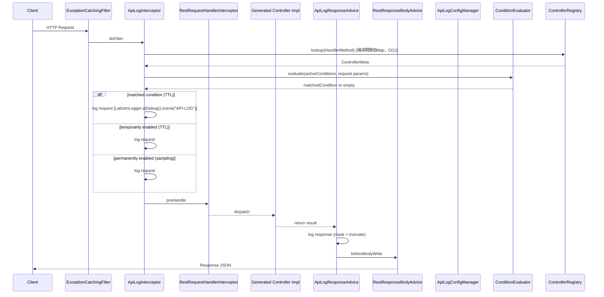

# Labzen Web — API 级日志打印功能设计方案（终版）

## 产品概述

为 Labzen Web 框架新增一套完整的 API 级别日志打印功能。通过运行时双拦截器（ApiLogInterceptor + ApiLogResponseAdvice）实现请求/响应/异常全生命周期日志记录，辅以 APT 编译期生成的元数据注册表消除运行时反射开销。配置采用"启动时程序化 API > classpath YAML > 框架默认"三层架构，运行时动态修改仅存内存。

---

## 核心功能（共 12 项）

### 1. 全量请求/响应/异常拦截
拦截所有 APT 生成的 Controller 方法，在请求进入时打印完整请求参数（URL、HTTP 方法、Query/Body 参数），在响应返回前打印响应内容（状态码、响应体），在异常发生时打印异常信息。文件上传识别 `UploadedFile`/`Part`/`MultipartFile` 类型参数打印元信息（fileName、fileSize、contentType），文件下载识别 `FileResult` 返回值打印文件元信息（filename、size）。零侵入。

### 2. 统一配置入口组件
`ApiLogConfigManager`（Spring Component）作为配置统一入口。提供 `configureGlobalDefaults()`、`configureController()`、`configureMethod()` 启动时程序化 API；`enableTemporarily()`、`registerCondition()` 运行时动态管理 API。

### 3. 方法级精准配置
利用编译期生成的 `LoggableControllerMetaRegistry` 元数据，支持按 Controller 接口名 + 方法名（如 `UserController.create`）或 HTTP 方法 + URL（如 `POST /api/user`）精准定位。

### 4. 结构化日志标识
使用 `LabzenLogger` 结构化 API：`.atDebug()`/`.atInfo()` 按配置级别分派、`.scene("API-LOG")` 场景标识、`.status()` 标记状态。Logger 名称为生成的 Controller 实现类全限定名。行号通过 `Thread.getStackTrace()` 计算偏移量。

### 5. 动态配置与实时切换
日志级别默认 DEBUG 且全局关闭（`enabled=false`）。运行时通过 `ApiLogConfigManager` 动态调整级别（TRACE/DEBUG/INFO/WARN/ERROR），实时生效不重启。

### 6. 参数精细化控制
每个 API 方法配置 `includeParams`（仅打印指定参数）或 `excludeParams`（排除指定参数，默认排除 password、secret、token、authorization），互斥优先 includeParams。

### 7. 采样率控制
`ApiEndpointLogConfig` 新增 `samplingRate` 字段（0.0~1.0，默认 1.0），通过 `ThreadLocalRandom` 按概率抽样，防止高 QPS 接口日志风暴。

### 8. 响应体脱敏
`ApiEndpointLogConfig` 新增 `responseMaskPatterns`（`Map<String,String>`），按 JSON Path 匹配字段名，使用预置规则（phone-mask/idcard-mask）做星号替换。

### 9. 临时开启自动过期
`enableTemporarily(controllerName, methodKey, duration)` 针对指定接口方法的全部请求无条件开启日志，到期自动关闭。

### 10. 条件日志机制
注册条件规则（`ApiLogCondition`）：请求参数满足特定条件时才打印日志。TTL 强制必选，`ScheduledExecutorService` 每 30 秒扫描清理过期规则。匹配类型（`MatchType` 枚举）：
- 字符串：`EQUALS`/`CONTAINS`/`REGEX`/`EXISTS`
- 数值：`GREATER_THAN`/`LESS_THAN`/`GREATER_THAN_OR_EQUAL`/`LESS_THAN_OR_EQUAL`
- 日期：`BEFORE`/`AFTER`（ISO-8601 格式）

### 11. 业务项目 YAML 配置
在 `src/main/resources/labzen-web/` 下放置以 Controller 接口名命名的 YAML 文件（如 `UserController.yml`），内含 `general` 通用配置和 `methods` Map。

### 12. 启动时程序化初始化
`ApiLogConfigManager` 提供给业务项目在 `@Configuration`/`ApplicationRunner`/`@PostConstruct` 中调用的方法，配置优先级高于 classpath YAML。

---

## 技术栈

| 组件 | 选型 |
|------|------|
| 语言 | Java 21 |
| 框架 | Spring Boot 3.x、Spring MVC |
| 配置解析 | SnakeYAML（Spring Boot 内置） |
| 日志 | SLF4J + cn.labzen:logger（LabzenLogger 结构化 API） |
| 代码生成 | JavaPoet（web-processor 现有） |
| 构建 | Maven（沿用 web-parent 依赖管理） |

---

## 实现方案

### 总体架构

采用 **双拦截器 + 独立配置管理 + APT 元数据注册** 架构：

1. **请求拦截**: `ApiLogInterceptor` 在 `preHandle` 中通过 `ApiLogControllerRegistry.lookup()`（编译期生成，O(1) 查表）获取 `ControllerMeta`→ 查条件匹配 → 查临时开启 → 查永久配置 → 打印请求日志
2. **响应拦截**: `ApiLogResponseAdvice` 在 `beforeBodyWrite` 中读取请求阶段缓存的配置，打印响应日志（含采样检查、脱敏、截断）
3. **异常日志**: 在现有 `LabzenHandlerExceptionResolver` 和 `LabzenExceptionCatchingFilter` 中集成
4. **配置管理**: `ApiLogConfigManager` 聚合 classpath YAML 加载 + 启动时程序化配置 + 运行时动态修改（仅内存）
5. **条件评估**: `ApiLogConditionEvaluator` 按 `MatchType` 对请求参数做匹配，过期时间自动清理

### 配置三层架构

```
启动时程序化 API（registerCondition/configureGlobalDefaults）  ← 最高优先级
> classpath YAML（resources/labzen-web/{ControllerName}.yml）
> 框架默认值（enabled=false, level=DEBUG, samplingRate=1.0）
```

取消运行时文件持久化（Spring Boot JAR 部署后 classpath 只读，文件系统不可靠）。运行时修改仅存内存，重启后丢失。

### 日志决策链（preHandle 中优先级）

1. **条件匹配** → 请求参数匹配活跃条件 → 使用条件中的 logLevel 打印（含采样）
2. **临时开启** → `enableTemporarily` 注册且未过期 → 按采样的 config 打印
3. **永久开启** → `ApiLogConfig.enabled=true` → 采样检查后打印
4. **跳过** → 以上均不满足，零开销透传

### 模块划分

| 模块 | 变更类型 | 职责 |
|------|---------|------|
| web-api | 新增 | ApiLogConfig、ApiLogCondition、MatchType 枚举、Constants 常量扩展 |
| web-core | 新增+修改 | 全部运行时实现：ConfigManager、Interceptor、Advice、MessageBuilder、ConditionEvaluator、ControllerRegistry、YamlApiLogStore、Spring 集成 |
| web-processor | 新增+修改 | MetadataGenerateProcessor（priority 7）、修改 InternalProcessor sealed 接口新增 permits |

### 系统交互流程



---

## 实现细节

### 性能
- 元数据查表 O(1)（静态 Map），无反射
- 配置缓存 `ConcurrentHashMap<Method, ApiLogConfig>`
- SLF4J `isDebugEnabled()` 前置判断，关闭时零开销
- 响应体序列化限制 4096 字符
- 采样通过 `ThreadLocalRandom.nextDouble()`，极低开销

### 线程安全
- `ApiLogConfigManager.mergedConfigs` → `ConcurrentHashMap`
- 条件列表 `activeConditions` → `CopyOnWriteArrayList`
- 过期清理 `ScheduledExecutorService` 单线程

### 文件处理
- 上传：`UploadedFile`/`Part`/`MultipartFile` → 打印 `fileName`、`fileSize`、`contentType`
- 下载：`FileResult` → 打印 `filename`、`value.length()`，不打印二进制

### 日志格式
```
[API-LOG] {implClass}#{method} | REQUEST  | POST /api/user | params: {json}
[API-LOG] {implClass}#{method} | RESPONSE | status=200 | body: {json} | cost=15ms
[API-LOG] {implClass}#{method} | EXCEPTION | {exceptionType}: {message}
```

### 向后兼容
- 默认 `enabled=false`，全局关闭，现有项目升级后无任何日志输出变化
- 新增组件通过 `LabzenWebComponentRegistrar` 按配置条件注册
- 不修改任何现有 API 接口、不修改 APT 处理器生成逻辑

### 日志安全
- 参数过滤默认排除 `password`、`secret`、`token`、`authorization`（大小写不敏感）
- 响应体脱敏仅按配置的 JSON Path 规则执行

---

## 目录结构

```
web-api/src/main/java/cn/labzen/web/api/
├── definition/
│   └── Constants.java                                  # [MODIFY] 新增请求属性键、默认敏感参数、日志场景常量
└── log/
    ├── ApiLogConfig.java                               # [NEW] 配置POJO
    ├── ApiLogCondition.java                            # [NEW] 条件日志规则POJO
    └── MatchType.java                                  # [NEW] 条件匹配类型枚举

web-core/src/main/java/cn/labzen/web/
├── meta/
│   └── WebCoreConfiguration.java                       # [MODIFY] 新增全局开关配置项
├── spring/
│   ├── LabzenWebConfigurer.java                        # [MODIFY] 注册ApiLogInterceptor
│   └── LabzenWebComponentRegistrar.java                # [MODIFY] 条件注册ApiLogResponseAdvice
└── log/                                                # [NEW]
    ├── ApiLogConfigManager.java                        # Spring @Component 配置统一入口
    ├── ApiLogInterceptor.java                          # HandlerInterceptor
    ├── ApiLogResponseAdvice.java                       # ResponseBodyAdvice+@RestControllerAdvice
    ├── ApiLogMessageBuilder.java                       # LabzenLogger日志构建工具
    ├── ApiLogControllerRegistry.java                   # 编译期生成的静态元数据注册表
    ├── ApiLogConditionEvaluator.java                   # 条件规则评估器
    └── YamlApiLogStore.java                            # 只读classpath YAML加载

web-processor/src/main/java/cn/labzen/web/apt/
├── processor/
│   ├── InternalProcessor.java                          # [MODIFY] sealed接口新增MetadataGenerateProcessor
│   └── MetadataGenerateProcessor.java                  # [NEW] 优先级7，生成LoggableControllerMetaRegistryImpl
```

---

## 关键数据模型

> 编码规范：避免使用 Lombok `@Builder`，纯数据载体（不可变规则定义）使用 Java `record class`，可变配置类使用普通 POJO + 手动工厂方法。

### ApiLogConfig（接口方法日志配置）— 普通可变类

由于配置需在运行时合并（merge）和修改，使用普通 POJO 而非 record。提供静态工厂 `frameDefaults()` 和实例方法 `mergeFrom(ApiLogConfig override)` 用于三层配置合并。

```java
package cn.labzen.web.api.log;

import java.time.Instant;
import java.util.*;

public class ApiLogConfig {
    private boolean enabled = false;
    private String level = "DEBUG";
    private boolean logRequestParams = true;     // 请求体开关（独立控制）
    private boolean logResponseBody = true;      // 响应体开关（独立控制）
    private boolean logException = true;
    private double samplingRate = 1.0;
    private Set<String> includeParams = new HashSet<>();
    private Set<String> excludeParams = new HashSet<>(Set.of("password", "secret", "token", "authorization"));
    private Map<String, String> responseMaskPatterns = new HashMap<>();
    private Instant expiresAt;                    // 临时开启时设置

    public static ApiLogConfig frameDefaults() {
        return new ApiLogConfig();
    }

    /** 用 override 中的非默认值字段覆盖当前实例，返回新实例 */
    public ApiLogConfig mergeFrom(ApiLogConfig override) { ... }

    // getters / setters ...
}
```

### ApiLogCondition（条件日志规则）— `record class`

纯数据载体，创建后不可变，TTL 强制必填校验在紧凑构造函数中执行：

```java
package cn.labzen.web.api.log;

import jakarta.annotation.Nonnull;
import java.time.Duration;
import java.time.Instant;
import java.util.UUID;

public record ApiLogCondition(
    String id,                    // UUID
    String controllerName,        // 目标Controller接口名，支持"*"
    String methodKey,             // 方法名或HTTP方法+URL，支持"*"
    MatchType matchType,
    String paramName,             // 要检查的请求参数名
    String matchValue,            // 匹配值（数值比较时parse为BigDecimal，日期比较时parse为ISO-8601）
    @Nonnull Duration ttl,        // 强制必填
    Instant expiresAt,            // createdAt + ttl
    Instant createdAt,
    String logLevel,
    boolean logRequestParams,     // 匹配后是否打印请求体
    boolean logResponseBody       // 匹配后是否打印响应体
) {
    public ApiLogCondition {
        Objects.requireNonNull(ttl, "条件日志的 TTL 为必填项");
        if (ttl.isNegative() || ttl.isZero()) {
            throw new IllegalArgumentException("TTL 必须为正值");
        }
        // expiresAt 由注册时计算（createdAt + ttl），不在此构造函数中设置
    }

    /** 创建时自动生成 ID、时间戳和过期时间 */
    public static ApiLogCondition of(
        String controllerName, String methodKey, MatchType matchType,
        String paramName, String matchValue, Duration ttl,
        String logLevel, boolean logRequestParams, boolean logResponseBody
    ) {
        Instant now = Instant.now();
        return new ApiLogCondition(
            UUID.randomUUID().toString(), controllerName, methodKey,
            matchType, paramName, matchValue, ttl,
            now.plus(ttl), now, logLevel, logRequestParams, logResponseBody
        );
    }
}
```

### MatchType 枚举

```java
public enum MatchType {
    // 字符串
    EQUALS,          // paramValue.equals(matchValue)
    CONTAINS,        // paramValue.contains(matchValue)
    REGEX,           // paramValue.matches(matchValue)
    EXISTS,          // paramName 存在即可，忽略 matchValue

    // 数值（将 paramValue 和 matchValue 解析为 BigDecimal 比较）
    GREATER_THAN,
    LESS_THAN,
    GREATER_THAN_OR_EQUAL,
    LESS_THAN_OR_EQUAL,

    // 日期（将 paramValue 和 matchValue 解析为 ISO-8601 日期比较）
    BEFORE,          // paramValue < matchValue
    AFTER            // paramValue > matchValue
}
```

### ApiLogConfigManager（核心配置入口）

```java
package cn.labzen.web.log;

@Component
public class ApiLogConfigManager {
    // === 启动时程序化初始化（优先级高于 classpath YAML）===
    public void configureGlobalDefaults(ApiLogConfig config) { ... }
    public void configureController(String controllerName, ApiLogConfig config) { ... }
    public void configureMethod(String controllerName, String methodKey, ApiLogConfig config) { ... }

    // === 运行时查询 ===
    public ApiLogConfig resolveConfig(HandlerMethod handlerMethod) { ... }

    // === 运行时动态修改（仅内存，重启丢失）===
    public void enable(String controllerName, String methodKey) { ... }
    public void disable(String controllerName, String methodKey) { ... }
    public void setLevel(String controllerName, String methodKey, String level) { ... }
    public void enableTemporarily(String controllerName, String methodKey, Duration duration) { ... }
    public void updateConfig(String controllerName, String methodKey, ApiLogConfig config) { ... }

    // === 条件日志管理 ===
    public ApiLogCondition registerCondition(ApiLogCondition condition) { ... }  // TTL强校验
    public void unregisterCondition(String conditionId) { ... }
    public List<ApiLogCondition> listActiveConditions() { ... }
}
```

---

## YAML 配置示例

文件路径：`src/main/resources/labzen-web/UserController.yml`

```yaml
general:
  enabled: true
  level: DEBUG
  samplingRate: 0.5
  logRequestParams: true    # 请求体开关（独立控制）
  logResponseBody: false    # 响应体开关（独立控制，生产环境建议关闭减少日志量）
  excludeParams:
    - password
    - secret
    - token

methods:
  create:
    enabled: true
    level: INFO
    logRequestParams: true
    logResponseBody: true   # 仅此接口打印响应体
    includeParams:
      - name
      - email

  "GET {id}":
    enabled: true
    level: DEBUG
    logResponseBody: true
    responseMaskPatterns:
      "$.phone": "phone-mask"
      "$.idCard": "idcard-mask"
```

---

## 实现任务清单（10 步）

| # | 任务 | 模块 | 依赖 |
|---|------|------|------|
| 1 | 定义 ApiLogConfig、ApiLogCondition、MatchType 数据模型，扩展 Constants 常量 | web-api | - |
| 2 | 实现 YamlApiLogStore，只读扫描 classpath:labzen-web/*.yml | web-core | 1 |
| 3 | 实现 ApiLogConfigManager，三层配置合并、启动时API、运行时管理、过期清理 | web-core | 2 |
| 4 | 实现 ApiLogConditionEvaluator，按 MatchType 完成三类匹配 | web-core | 1 |
| 5 | 修改 InternalProcessor sealed 接口 + 新增 MetadataGenerateProcessor，编译期生成静态注册表 | web-processor | - |
| 6 | 实现 ApiLogMessageBuilder，LabzenLogger 结构化日志、参数过滤、文件处理、脱敏 | web-core | 1 |
| 7 | 实现 ApiLogInterceptor，完整决策链（条件→临时→永久），整合 Registry + ConditionEvaluator | web-core | 3,4,5 |
| 8 | 实现 ApiLogResponseAdvice，响应日志打印（文件/普通分支、脱敏、截断） | web-core | 3,6 |
| 9 | 在 LabzenHandlerExceptionResolver 和 ExceptionCatchingFilter 集成异常日志 | web-core | 3,6 |
| 10 | 修改 LabzenWebConfigurer、ComponentRegistrar、WebCoreConfiguration 完成 Spring 注册 | web-core | 7,8 |

---

## 变更记录

- **初版**：基于原始 9 项需求设计
- **终版**：整合四点修正 + 四条增强建议 + 条件日志机制
  - 取消运行时文件持久化
  - 新增 APT 元数据注册表
  - 新增采样率控制
  - 新增临时开启自动过期
  - 新增响应体脱敏
  - 新增条件日志（含完整 MatchType：字符串/数值/日期）
  - 充分利用 LabzenLogger 结构化 API
  - 文件上传下载参数处理策略
